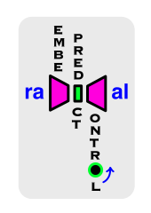

<a id="readme-top"></a>

[![LinkedIn][linkedin-shield]][linkedin-url]

<!-- PROJECT LOGO -->
<br />
<div align="center">
  <a href="https://github.com/PatGCaspuenas/raDICal">
    
  </a>

  <h3 align="center">raDICal</h3>

  <p align="center">
    Embedding and prediction pipeline of forced velocity flowfields
    <br />
    <a href="https://github.com/PatGCaspuenas/raDICal/blob/master/docs/_build/html/index.html"><strong>Explore the docs »</strong></a>
    <br />
    <br />
  </p>
</div>


<!-- TABLE OF CONTENTS -->
<details>
  <summary>Table of Contents</summary>
  <ol>
    <li>
      <a href="#about-the-project">About The Project</a>
      <ul>
        <li><a href="#structure">Structure</a></li>
      </ul>
    </li>
    <li>
      <a href="#getting-started">Getting Started</a>
      <ul>
        <li><a href="#dependencies">Dependencies</a></li>
        <li><a href="#installation">Installation</a></li>
      </ul>
    </li>
    <li><a href="#usage">Usage</a></li>
    <li><a href="#contact">Contact</a></li>
    <li><a href="#acknowledgments">Acknowledgments</a></li>
  </ol>
</details>


<!-- ABOUT THE PROJECT -->
## About The Project


<p align="right">(<a href="#readme-top">back to top</a>)</p>


### Structure

[![raDICal structure][structure-screenshot]]
* The main.py function contains the `Runner` class, which executes sequentially the commands given in the `\INPUTS\USER_COMMANDS.txt` file, from top to bottom. The existence of this class allows for a modular and more flexible running process; each subprocess, e.g. AE training, data loading, AE reconstruction... can be ignored or executed in the desired order for each specific run. 
* The `\utils` directory contains all the modules and functions required to execute the Runner class. The `\pre-processing` subdirectory contains several MATLAB and python functions that have been used to prepare the available datasets. Please refer to the GitHub documentation for access to the modules and function descriptions.
* The `\DATA` directory contains all leveraged datasets in the process. The content of this folder is only available in Zenodo.
* The `\MODELS` directory contains some saved trained AE and dynamical predictor models, to be loaded if training of a new model is to be avoided.
* The `\OUTPUTS` directory is the chosen path to save all outputs of the `SAVE_` subprocesses from the Runner class.
* The `\INPUTS` directory contains the only user-modifiable files in the repository.
	* `.json` files contain the default flags, parameters and paths to run the method. Their variables are listed below.
    * The `USER_COMMANDS.txt` file, as mentioned above, consists of the subprocesses called in the Runner class. The order to follow is from top to bottom. with one row per subprocess.All of the possible commands are included below.
    * The `USER_INPUTS.csv` consists of a list, where each row corresponds to a different run, and each column to a parameter, flag or path that is aimed to have a different value that the default one. The `Runner` class will execute all cases from the `.csv` list under the subprocesses required in the `USER_COMMANDS.txt` file.

<p align="right">(<a href="#readme-top">back to top</a>)</p>


<!-- GETTING STARTED -->
## Getting Started


### Dependencies
The code was run with Python version 3.8.10. The installed python libraries for the repository, along with their compatible versions, are shown below.

[![raDICal dependencies][dependencies-screenshot]]

The Tensorflow framework has been the main tool used to train and implement the Machine Learning models. GPU support for the installed TensorFlow version requires a build configuration with cuDNN compute compatibility of 8.6 and a CUDA Toolkit version of 11.8.

### Installation


1. Clone the repo
   ```sh
   git clone https://github.com/PatGCaspuenas/raDICal.git
   ```
2. Install packages
   ```sh
   pip install -r requirements.txt
   ```


<p align="right">(<a href="#readme-top">back to top</a>)</p>


<!-- USAGE EXAMPLES -->
## Usage


<p align="right">(<a href="#readme-top">back to top</a>)</p>


<!-- CONTACT -->
## Contact

Patricia García Caspueñas - patricia.gcaspuenas@gmail.com

Project Link: [https://github.com/PatGCaspuenas/raDICal](https://github.com/PatGCaspuenas/raDICal)

<p align="right">(<a href="#readme-top">back to top</a>)</p>


<!-- ACKNOWLEDGMENTS -->
## Acknowledgments


<p align="right">(<a href="#readme-top">back to top</a>)</p>


<!-- MARKDOWN LINKS & IMAGES -->
<!-- https://www.markdownguide.org/basic-syntax/#reference-style-links -->
[linkedin-shield]: https://img.shields.io/badge/-LinkedIn-black.svg?style=for-the-badge&logo=linkedin&colorB=555
[linkedin-url]: https://www.linkedin.com/in/patricia-garc%C3%ADa-caspue%C3%B1as-876063215/
[structure-screenshot]: Images/raDICal_structure.png
[dependencies-screenshot]: Images/raDICal_dependencies.png
